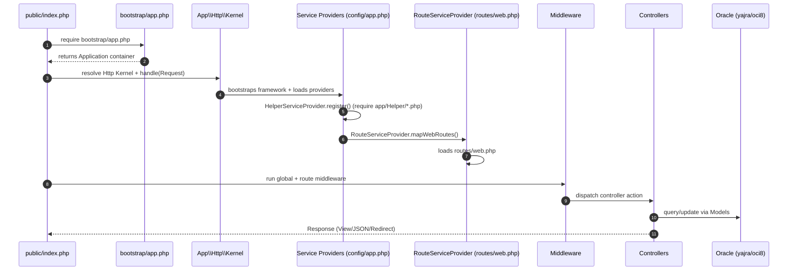

# NR-CSR (Corporate Social Responsibility)

Laravel 6 (PHP ^7.2) monolith for CSR proposal intake, evaluation/survey workflow, budgeting (Anggaran/Proker), payments, and reporting dashboards.

> This repository previously contained the default Laravel README; it has been replaced with project-specific documentation and charts.

## Tech Stack

- **Backend**: Laravel Framework `^6.0`
- **DB**: Oracle (via `yajra/laravel-oci8`)
- **UI**: Blade views + `webpack.mix.js` (Laravel Mix)
- **Reporting / Export**: `maatwebsite/excel` + `yajra/laravel-datatables-oracle`
- **Captcha**: `anhskohbo/no-captcha`

## Business / Domain Map

The main business modules are derived from route prefixes and controller responsibilities.

```mermaid
flowchart TB
  %% Users
  Admin([Admin])
  User([Internal User])
  Finance([Finance])
  Report([Report/Monitoring])
  Legal([Legal])
  Vendor([Vendor])
  Subsidiary([Subsidiary User])

  %% Modules
  Auth[Authentication & OTP (LoginController)]
  Master[Master Data (Role/User/Anggota/Hirarki/Sektor/Kebijakan/SDG/Pilar/Perusahaan/Exception)]
  Proposal[Proposal Intake (Kelayakan/SubProposal/Lembaga/Lampiran)]
  Evaluasi[Evaluation (EvaluasiController)]
  Survei[Survey (SurveiController)]
  LegalDocs[Legal Documents (BAST/SPK)]
  Budget[Budgeting & Programs (Anggaran/Proker/Relokasi/Alokasi)]
  Payment[Payment Execution (PembayaranController + Popay endpoints)]
  Dashboard[Dashboards (DashboardController + Proposal dashboard)]
  Reporting[Reporting & Exports (Laporan/Report/APIController)]
  VendorReg[Vendor Registration & Docs (VendorController)]
  Subs[Subsidiary Flows (Dashboard/Anggaran/Relokasi/Realisasi/Report Subsidiary)]
  Tasklist[Tasklists / Approvals (Tasklist*Controller)]

  %% Relationships (high-level)
  Admin --> Auth
  User --> Auth
  Finance --> Auth
  Report --> Auth
  Legal --> Auth
  Vendor --> Auth
  Subsidiary --> Auth

  Admin --> Master
  User --> Proposal
  User --> Evaluasi
  User --> Survei
  Report --> Reporting
  Finance --> Budget
  Finance --> Payment
  Legal --> LegalDocs
  Vendor --> VendorReg
  Subsidiary --> Subs
  Report --> Tasklist
  Legal --> Tasklist
  User --> Dashboard
  Finance --> Dashboard
  Subsidiary --> Dashboard
```

## Architecture Overview

This codebase follows a classic Laravel monolith pattern: Routes → Middleware → Controllers → Eloquent Models/DB, with Blade views for HTML responses and some endpoints serving JSON for dashboards.

```mermaid
flowchart LR
  Browser[Browser / User Agent]
  VendorPortal[Vendor Portal]
  SubsPortal[Subsidiary Portal]
  Artisan[Artisan CLI]

  subgraph LaravelApp[Laravel Application]
    Routes[routes/web.php + routes/api.php]
    MW[Middleware (web, cred.login, timeOut, role guards)]
    Controllers[Controllers (app/Http/Controllers)]
    Views[Blade Views (resources/views)]
    Models[Eloquent Models (app/Models + View* models)]
    Exports[Excel Exports (app/Exports)]
    Imports[Excel Imports (app/Imports)]
    Helpers[Helpers (app/Helper/* via HelperServiceProvider)]
  end

  DB[(Oracle Database)]
  FileStore[(Storage/public uploads)]
  External[External Services (reCAPTCHA, possible payment/Popay)]

  Browser --> Routes
  VendorPortal --> Routes
  SubsPortal --> Routes
  Routes --> MW --> Controllers
  Controllers --> Views
  Controllers --> Models --> DB
  Controllers --> Exports
  Imports --> Models
  Controllers --> FileStore
  Controllers --> External
  Artisan --> LaravelApp
```

### Key Middleware / Authorization

Route groups use role-based middleware defined in `app/Http/Kernel.php`:

- `isAdmin`, `isUser`, `isFinance`, `isReport`, `isLegal`, `isSubsidiary`
- Session control: `cred.login`, `timeOut`

## Initialization / Boot Flow

Laravel boot sequence (simplified) for this repository:



## Local Setup (Initialization Steps)

> Exact environment variables are in `.env` (not committed). The steps below describe the typical Laravel 6 + Oracle setup.

1. Install dependencies
   - `composer install`
   - `npm install`
2. Create environment file
   - copy `.env.example` → `.env`
   - set at minimum: `APP_NAME`, `APP_ENV`, `APP_KEY`, `APP_URL`
   - configure **Oracle** connection in `.env` (see `config/database.php` and `config/oracle.php`)
3. Generate app key
   - `php artisan key:generate`
4. Build frontend assets (if needed)
   - `npm run dev` (or `npm run prod`)
5. Run the application
   - `php artisan serve`
6. (Optional) Run tests
   - `vendor/bin/phpunit`

## Main Route Areas (Quick Map)

- `/auth/*` - login, forgot/reset password, OTP
- `/dashboard/*` - dashboards
- `/master/*` - admin master data
- `/proposal/*` - proposal intake & supporting entities
- `/anggaran/*` - budgeting and program (Proker) management
- `/report/*` - reporting, exports, monitoring
- `/DokumenLegal/*` - BAST/SPK documents
- `/subsidiary/*` - subsidiary dashboards, budgeting, realization, reporting

## Notes

- This README uses Mermaid diagrams. GitHub renders Mermaid automatically; for other renderers ensure Mermaid is enabled.
