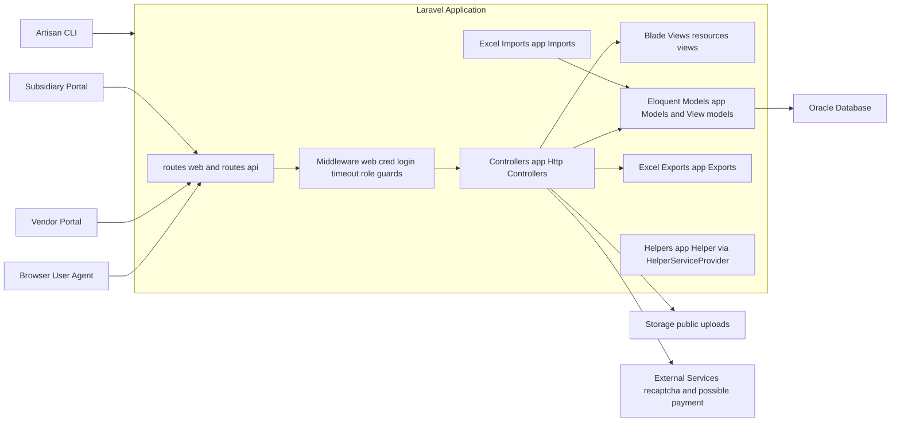
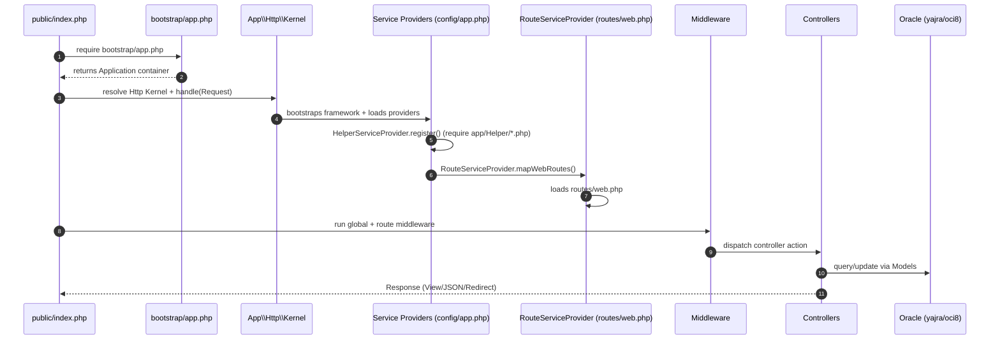

# NR-CSR (Corporate Social Responsibility)

Laravel 6 (PHP ^7.2) monolith for CSR proposal intake, evaluation/survey workflow, budgeting (Anggaran/Proker), payments, and reporting dashboards.

> This repository previously contained the default Laravel README; it has been replaced with project-specific documentation and charts.

## Table of Contents

- [Tech Stack](#tech-stack)
- [Business / Domain Map](#business--domain-map)
- [Architecture Overview](#architecture-overview)
- [Phase B Refactor Summary](#phase-b-refactor-summary)
- [Key Middleware / Authorization](#key-middleware--authorization)
- [Initialization / Boot Flow](#initialization--boot-flow)
- [Getting Started](#getting-started)
  - [Prerequisites](#prerequisites)
  - [Local Setup (Standard)](#local-setup-standard)
  - [Docker Setup (PostgreSQL)](#docker-setup-postgresql)
- [Main Route Areas](#main-route-areas-quick-map)
- [Project Maintenance](#project-maintenance)
  - [Quality Gates (Priority 2)](#quality-gates-priority-2)
  - [Strategic Baseline (Priority 3)](#strategic-baseline-priority-3)
  - [Dependency Hygiene Plan](#dependency-hygiene-plan)
- [Troubleshooting](#troubleshooting)
- [Contributing](#contributing)
- [Notes](#notes)

## Tech Stack

- **Backend**: Laravel Framework `^6.0`
- **DB**: PostgreSQL (Docker local) / Oracle (legacy via `yajra/laravel-oci8`)
- **UI**: Blade views + `webpack.mix.js` (Laravel Mix)
- **Reporting / Export**: `maatwebsite/excel` + `yajra/laravel-datatables-oracle`
- **Captcha**: `anhskohbo/no-captcha`

## Business / Domain Map

The main business modules are derived from route prefixes and controller responsibilities.

```mermaid
flowchart TB
  %% Users
  Admin([Admin])
  User([Internal User])
  Finance([Finance])
  Report([Report Monitoring])
  Legal([Legal])
  Vendor([Vendor])
  Subsidiary([Subsidiary User])

  %% Modules
  Auth[Authentication and OTP]
  Master[Master Data]
  Proposal[Proposal Intake]
  Evaluasi[Evaluation]
  Survei[Survey]
  LegalDocs[Legal Documents]
  Budget[Budgeting and Programs]
  Payment[Payment Execution]
  Dashboard[Dashboards]
  Reporting[Reporting and Exports]
  VendorReg[Vendor Registration and Docs]
  Subs[Subsidiary Flows]
  Tasklist[Tasklists and Approvals]

  %% Details (kept simple to avoid Mermaid parsing issues on GitHub)
  AuthDetail[LoginController]
  MasterDetail[Role User Anggota Hirarki Sektor Kebijakan SDG Pilar Perusahaan Exception]
  ProposalDetail[Kelayakan SubProposal Lembaga Lampiran]
  BudgetDetail[Anggaran Proker Relokasi Alokasi]
  PaymentDetail[PembayaranController Popay]
  ReportingDetail[LaporanController ReportController APIController]

  %% Relationships (high-level)
  Admin --> Auth
  User --> Auth
  Finance --> Auth
  Report --> Auth
  Legal --> Auth
  Vendor --> Auth
  Subsidiary --> Auth

  Admin --> Master
  Master --> MasterDetail
  User --> Proposal
  Proposal --> ProposalDetail
  User --> Evaluasi
  User --> Survei
  Report --> Reporting
  Reporting --> ReportingDetail
  Finance --> Budget
  Budget --> BudgetDetail
  Finance --> Payment
  Payment --> PaymentDetail
  Legal --> LegalDocs
  Vendor --> VendorReg
  Subsidiary --> Subs
  Report --> Tasklist
  Legal --> Tasklist
  User --> Dashboard
  Finance --> Dashboard
  Subsidiary --> Dashboard

  Admin --> Auth
  User --> Auth
  Finance --> Auth
  Report --> Auth
  Legal --> Auth
  Vendor --> Auth
  Subsidiary --> Auth
  Auth --> AuthDetail
```



## Architecture Overview

This codebase follows a classic Laravel monolith pattern: Routes → Middleware → Controllers → Eloquent Models/DB, with Blade views for HTML responses and some endpoints serving JSON for dashboards.



## Phase B Refactor Summary

Phase B implementation in this repository is now reflected in code:

- Controller decomposition (top 4 large controllers):
  - `KelayakanController` -> `app/Services/Kelayakan/KelayakanProposalService.php`
  - `APIController` -> `app/Services/API/ApiPaymentRequestService.php` + `app/Actions/API/StoreApiPaymentRequestAction.php`
  - `DashboardController` -> `app/Services/Dashboard/DashboardOverviewService.php`
  - `TasklistSurveiController` -> `app/Services/Tasklist/TasklistSurveiService.php`
- Route modularization:
  - Web entrypoint remains `routes/web.php` and now includes `routes/web/legacy.php`, `routes/web/public-auth.php`, `routes/web/public-form.php`, and `routes/web/protected.php`
  - API entrypoint remains `routes/api.php` and now includes:
    - `routes/api/wilayah.php`
    - `routes/api/payment.php`
    - `routes/api/health.php`
- FormRequest standardization expanded across major flows (Kelayakan, API payment/realisasi filters, Pekerjaan, Survei, ReportSubsidiary).

### Key Middleware / Authorization

Route groups use role-based middleware defined in `app/Http/Kernel.php`:

- `isAdmin`, `isUser`, `isFinance`, `isReport`, `isLegal`, `isSubsidiary`
- Session control: `cred.login`, `timeOut`

### Authentication Context (Priority 1)

Authentication/session state is now centralized via:

- `app/Services/Auth/AuthContext.php`
- Service binding in `app/Providers/AppServiceProvider.php`

Critical middleware and controllers now consume `AuthContext` instead of reading `session('user')` directly in those refactored paths. This keeps login/session-timeout/role-gate behavior consistent while reducing repeated session handling logic.

## Initialization / Boot Flow

Laravel boot sequence (simplified) for this repository:



## Getting Started

### Prerequisites

- **PHP**: ^7.2 (PHP 7.4 recommended)
- **Composer**: Latest version
- **Node.js**: v12+ and npm
- **Database**: PostgreSQL 12+ (Docker) or Oracle 12c+ (legacy)
- **Web Server**: Apache/Nginx or use `php artisan serve`

### Local Setup (Standard)

> Exact environment variables are in `.env` (not committed). The steps below describe the typical Laravel 6 + Oracle setup.

1. **Clone the repository**
   ```bash
   git clone https://github.com/NusantaraRegas/nr-csr.git
   cd nr-csr
   ```

2. **Install dependencies**
   ```bash
   composer install
   npm install
   ```

3. **Create environment file**
   ```bash
   # Windows
   copy .env.example .env
   
   # Linux/macOS
   cp .env.example .env
   ```
   
   Configure at minimum:
   - `APP_NAME`, `APP_ENV`, `APP_KEY`, `APP_URL`
   - **Oracle** connection settings (see `config/database.php` and `config/oracle.php`)

4. **Generate application key**
   ```bash
   php artisan key:generate
   ```

5. **Build frontend assets**
   ```bash
   # Development
   npm run dev
   
   # Production
   npm run prod
   ```

6. **Run database migrations**
   ```bash
   php artisan migrate
   ```

7. **Start the development server**
   ```bash
   php artisan serve
   ```
   
   Access the application at `http://localhost:8000`

8. **(Optional) Run tests**
   ```bash
   php artisan test
   ```

### Docker Setup (PostgreSQL)

This repo can be run fully via Docker using PostgreSQL.

#### Database Schema Source

The repository includes an Oracle → PostgreSQL converted schema dump:

- `tools/NR_CSR.sql`

From that dump we generate Laravel migrations (Postgres) under `database/migrations/2026_01_12_*`.

> **Note**: Some views in the original Oracle schema reference objects under `NR_PAYMENT.*`. In this repo we keep those as **stubs/TODO** so migrations can run in a standalone `NR_CSR` database.

#### Step-by-Step Docker Setup

1. **Bring up containers**
   ```bash
   docker compose up -d --build
   ```

2. **Create `.env` file**
   ```bash
   # Windows
   copy .env.docker.example .env
   
   # Linux/macOS
   cp .env.docker.example .env
   ```
   
   Generate app key:
   ```bash
   docker compose exec -T app php artisan key:generate --force
   ```

3. **Install PHP dependencies**
   
   This project includes packages that require extensions used by Oracle (oci8) and Excel exports (gd). If running Postgres-only locally, install dependencies while ignoring platform requirements:
   
   ```bash
   docker compose exec -T app composer install --no-interaction --ignore-platform-req=ext-gd --ignore-platform-req=ext-oci8
   ```

4. **Run migrations**
   ```bash
   docker compose exec -T app php artisan migrate --force
   ```
   
   To rebuild schema from scratch:
   ```bash
   docker compose exec -T app php artisan migrate:fresh --force
   ```

5. **(Optional) Verify schema**
   
   List tables created in the NR_CSR schema:
   ```bash
   docker compose exec -T db psql -U nr_csr -d nr_csr -c "SELECT schemaname, tablename FROM pg_tables WHERE schemaname IN ('NR_CSR') ORDER BY tablename;"
   ```

6. **Access the application**
   
   Nginx is exposed on:
   ```
   http://localhost:8080
   ```

#### Docker Commands Reference

```bash
# Start containers
docker compose up -d

# Stop containers
docker compose down

# View logs
docker compose logs -f app

# Access application container shell
docker compose exec app bash

# Access database
docker compose exec db psql -U nr_csr -d nr_csr

# Rebuild containers
docker compose up -d --build --force-recreate
```

## Main Route Areas (Quick Map)

| Route Prefix | Description |
|--------------|-------------|
| `/auth/*` | Login, forgot/reset password, OTP |
| `/dashboard/*` | Dashboards for different user roles |
| `/master/*` | Admin master data management |
| `/proposal/*` | Proposal intake & supporting entities |
| `/anggaran/*` | Budgeting and program (Proker) management |
| `/report/*` | Reporting, exports, monitoring |
| `/DokumenLegal/*` | BAST/SPK legal documents |
| `/subsidiary/*` | Subsidiary dashboards, budgeting, realization, reporting |

### Route File Modularization (Priority 1)

`routes/web.php` now acts as a thin loader and delegates route groups into domain files:

- Public files:
  - `routes/web/public-auth.php`
  - `routes/web/public-form.php`
- Protected wrapper:
  - `routes/web/protected.php`
- Legacy compatibility route:
  - `routes/web/legacy.php`
- Protected domains:
  - `routes/web/protected/dashboard.php`
  - `routes/web/protected/master.php`
  - `routes/web/protected/vendor.php`
  - `routes/web/protected/operasional.php`
  - `routes/web/protected/proposal.php`
  - `routes/web/protected/anggaran.php`
  - `routes/web/protected/report.php`
  - `routes/web/protected/payment.php`
  - `routes/web/protected/export-popay.php`
  - `routes/web/protected/todo.php`
  - `routes/web/protected/tasklist.php`
  - `routes/web/protected/tasklist-legal.php`
  - `routes/web/protected/dokumen-legal.php`
  - `routes/web/protected/profile.php`
  - `routes/web/protected/subsidiary.php`

`routes/api.php` also acts as an entrypoint loader:

- `routes/api/wilayah.php`
- `routes/api/payment.php`
- `routes/api/health.php`

## Project Maintenance

### Git Ignore Configuration

The project includes comprehensive `.gitignore` files to prevent committing unnecessary files:

**Root `.gitignore`:**
- Laravel/PHP: vendor dependencies, IDE helpers, test coverage, Homestead configs
- Node/Frontend: node_modules, build artifacts, npm/yarn cache and logs
- IDEs: .idea/, .vscode/, editor swap and backup files
- Operating Systems: macOS (.DS_Store), Windows (Thumbs.db), Linux (.directory)
- Docker: local volumes, docker-compose overrides
- Process files: PIDs, lock files

**`public/template/assets/.gitignore`:**
- Node dependencies (node_modules/, bower_components/)
- Build output (dist/, build/, minified files)
- Cache and log files
- OS and editor-specific files

These configurations ensure clean repositories by excluding auto-generated files, local configurations, and build artifacts.

### Quality Gates (Priority 2)

Priority 2 reliability baseline is now enforced through the workflow:

- `.github/workflows/security-guardrail.yml` (workflow name: **Quality Baseline**)

It runs these checks on push/PR in this order:

1. Hardcoded-secret guardrail (`php tools/security_guardrail_check.php`)
2. Static analysis baseline (`composer run quality:static`)
3. Style baseline (`composer run quality:style`)
4. Critical-path feature tests (`composer run quality:test:critical`)

Tooling baseline notes:

- PHPStan/Larastan runs through `phpstan.neon.dist` with local include `phpstan.larastan.extension.neon` to avoid legacy deprecated-option noise from vendor defaults.
- Larastan dependency line has been migrated to `larastan/larastan` and pinned to `1.0.3` for current Laravel 6 / PHP 7.4 / PHPStan 1.x compatibility.
- Larastan `2.x/3.x` requires newer PHP/Laravel lines and is tracked as a dependency-roadmap follow-up in `docs/dependency-hygiene-plan.md`.
- PHP-CS-Fixer baseline is on v3 (`friendsofphp/php-cs-fixer`).

Local equivalent command set (runtime-compatible in this repository):

```bash
docker compose run --rm php74-pgsql "vendor/bin/composer run security:guardrail"
docker compose run --rm php74-pgsql "vendor/bin/composer run quality:static"
docker compose run --rm php74-pgsql "vendor/bin/composer run quality:style"
docker compose run --rm php74-pgsql "vendor/bin/composer run quality:test:critical"
```

### Strategic Baseline (Priority 3)

Priority 3 strategic improvements are now available in incremental form:

1. API response/error contracts for key `/api/*` JSON endpoints
2. Health checks + alerting baseline
3. Proposal-domain modularization pilot (`storeSubProposal`)

#### API Response Contract

Standard envelope helper:

- `app/Support/ApiResponse.php`

Representative endpoints already normalized:

- `GET /api/dataProvinsi`
- `GET /api/dataKabupaten/{prov}`
- `POST /api/dataKecamatan`
- `POST /api/dataKelurahan`
- `POST /api/dataKodePos`
- `POST /api/updateStatus`

Envelope shape:

```json
{
  "success": true,
  "message": "OK",
  "data": {},
  "errors": null,
  "meta": {}
}
```

API exception rendering for validation/auth/http/internal errors is centralized in:

- `app/Exceptions/Handler.php`

Contract tests:

```bash
docker compose run --rm php74-pgsql "vendor/bin/phpunit tests/Feature/ApiResponseContractTest.php"
```

#### Health Checks + Alerting

Endpoints:

- `GET /api/health`
- `GET /api/health/dependencies` (optional token via `X-Health-Token`)

Configuration:

- `config/health.php`
- `HEALTH_ALLOW_SIMULATION` (default: `false`)
- `HEALTH_CHECK_TOKEN` (optional)
- `HEALTH_ALERTING_ENABLED` (default: `true`)
- `HEALTH_ALERT_LOG_CHANNEL` (default: `LOG_CHANNEL`)

Checks covered:

- Database connectivity
- Queue dependency status (healthy/degraded/unhealthy based on driver/runtime conditions)
- Mail dependency status (healthy/degraded based on driver/configuration)
- Optional transport-level probes:
  - SMTP TCP connectivity and optional SMTP auth handshake probe
  - SQS queue endpoint reachability probe
  - Beanstalkd socket connectivity probe

Transport probe configuration (`config/health.php`):

- `HEALTH_PROBE_TIMEOUT_SECONDS` (default: `2`)
- `HEALTH_PROBE_TIMEOUT_MIN_SECONDS` (default: `0.2`)
- `HEALTH_PROBE_TIMEOUT_MAX_SECONDS` (default: `5`)
- `HEALTH_PROBE_ALLOWED_ENVIRONMENTS` (default: `production`)
- `HEALTH_PROBE_ALLOW_NON_PRODUCTION` (default: `false`)
- `HEALTH_PROBE_ALLOW_IN_CI` (default: `false`)
- `HEALTH_SMTP_TRANSPORT_PROBE` (default: `false`)
- `HEALTH_SQS_TRANSPORT_PROBE` (default: `false`)
- `HEALTH_BEANSTALK_TRANSPORT_PROBE` (default: `false`)

Operational note:

- Local/dev/CI safe default (probes remain skipped even if a toggle is accidentally enabled):
  - `HEALTH_PROBE_ALLOWED_ENVIRONMENTS=production`
  - `HEALTH_PROBE_ALLOW_NON_PRODUCTION=false`
  - `HEALTH_PROBE_ALLOW_IN_CI=false`
  - keep `HEALTH_SMTP_TRANSPORT_PROBE`, `HEALTH_SQS_TRANSPORT_PROBE`, `HEALTH_BEANSTALK_TRANSPORT_PROBE` as `false`
- Production rollout example (enable only dependencies actually used by this deployment):
  - `HEALTH_PROBE_ALLOWED_ENVIRONMENTS=production`
  - `HEALTH_PROBE_TIMEOUT_SECONDS=1.5`
  - `HEALTH_PROBE_TIMEOUT_MIN_SECONDS=0.2`
  - `HEALTH_PROBE_TIMEOUT_MAX_SECONDS=3`
  - set only needed driver toggles to `true`
- Timeout guardrails are clamped to min/max bounds to prevent long-hanging probes.
- When a probe is enabled but required config/infrastructure is missing, health returns explicit degraded metadata (`probe`, `reason`, `probe_requested`) instead of silently failing.

Health tests:

```bash
docker compose run --rm php74-pgsql "vendor/bin/phpunit tests/Feature/HealthCheckEndpointsTest.php"
```

#### API Receiver Endpoint Transition

- `GET /api/dataReceiver` now returns standard JSON envelope (`ApiResponse`) with receiver data.
- Legacy HTML option rendering is temporarily available at:
  - `GET /legacy/dataReceiver/options`

Transition note:

- UI consumers should migrate to `/api/dataReceiver` JSON.
- Decommission `/legacy/dataReceiver/options` only after all consumers are confirmed migrated.

Legacy endpoint decommission config (`config/data_receiver.php`):

- `LEGACY_DATA_RECEIVER_OPTIONS_ENABLED` (default: `true`)
- `LEGACY_DATA_RECEIVER_OPTIONS_PHASE`:
  - `phase1`: endpoint enabled, serves HTML adapter, logs warning telemetry per request (`legacy.data_receiver_options.deprecated_access`)
  - `phase2`: endpoint disabled, returns deterministic JSON error with `meta.code=LEGACY_DATA_RECEIVER_OPTIONS_DECOMMISSIONED`
- `LEGACY_DATA_RECEIVER_OPTIONS_DISABLED_STATUS` (default: `410`)
- `LEGACY_DATA_RECEIVER_OPTIONS_LOG_CHANNEL` (default: `LOG_CHANNEL`)
- `LEGACY_DATA_RECEIVER_OPTIONS_SUNSET_DATE` (optional response header during phase1)

Migration checklist:

1. Inventory all callers of `/legacy/dataReceiver/options`.
2. Migrate callers to `/api/dataReceiver` JSON.
3. Monitor phase1 warning logs for residual callers.
4. Switch to `phase2` only when usage reaches zero for agreed window.
5. Keep deterministic error response during phase2 for controlled consumer failure handling.

Rollback:

1. Set `LEGACY_DATA_RECEIVER_OPTIONS_PHASE=phase1`.
2. Set `LEGACY_DATA_RECEIVER_OPTIONS_ENABLED=true`.
3. Clear config/route cache if used (`php artisan config:clear && php artisan route:clear`).
4. Confirm route target returns to `APIController@dataReceiverOptions` via `php artisan route:list --path=legacy/dataReceiver/options`.

#### Proposal Modularization Pilot

Pilot extraction applied to proposal flow `POST /proposal/storeSubProposal`:

- `app/Http/Controllers/SubProposalController.php` (entrypoint kept stable)
- `app/Http/Requests/StoreSubProposalRequest.php`
- `app/Actions/SubProposal/StoreSubProposalAction.php`
- `app/Services/SubProposal/StoreSubProposalService.php`

Regression tests:

```bash
docker compose run --rm php74-pgsql "vendor/bin/phpunit tests/Feature/ProposalModulePilotExtractionTest.php"
```

### Dependency Hygiene Plan

Phased upgrade planning and compatibility/risk matrix are documented in:

- `docs/dependency-hygiene-plan.md`

### Maintenance Commands

```bash
# Clear application cache
php artisan cache:clear

# Clear configuration cache
php artisan config:clear

# Clear route cache
php artisan route:clear

# Clear view cache
php artisan view:clear

# Optimize application for production
php artisan optimize

# Regenerate autoload files
composer dump-autoload
```

## Troubleshooting

### Common Issues

#### 1. Migration Errors

**Problem**: Migration fails with foreign key constraints

**Solution**: 
```bash
# Drop all tables and re-run migrations
php artisan migrate:fresh

# Or for Docker
docker compose exec -T app php artisan migrate:fresh --force
```

#### 2. Permission Errors (Linux/macOS)

**Problem**: `storage` or `bootstrap/cache` permission denied

**Solution**:
```bash
chmod -R 775 storage bootstrap/cache
chown -R www-data:www-data storage bootstrap/cache
```

#### 3. Oracle Connection Issues

**Problem**: `ORA-12154: TNS:could not resolve the connect identifier`

**Solution**:
- Verify Oracle connection settings in `.env`
- Ensure Oracle client is properly installed
- Check `TNS_ADMIN` environment variable

#### 4. Composer Install Fails

**Problem**: Extensions missing (oci8, gd, etc.)

**Solution**:
```bash
# For local development with PostgreSQL, ignore platform requirements
composer install --ignore-platform-req=ext-gd --ignore-platform-req=ext-zip --ignore-platform-req=ext-oci8
```

#### 5. Frontend Assets Not Loading

**Problem**: CSS/JS not loading after pulling changes

**Solution**:
```bash
# Reinstall node modules
rm -rf node_modules package-lock.json
npm install

# Rebuild assets
npm run dev
```

#### 6. Docker Container Issues

**Problem**: Containers won't start or database connection fails

**Solution**:
```bash
# Rebuild containers from scratch
docker compose down -v
docker compose up -d --build --force-recreate

# Check container logs
docker compose logs -f
```

## Contributing

1. **Fork the repository**
2. **Create a feature branch**
   ```bash
   git checkout -b feature/your-feature-name
   ```
3. **Make your changes**
4. **Commit with descriptive messages**
   ```bash
   git commit -m "Add: description of your changes"
   ```
5. **Push to your fork**
   ```bash
   git push origin feature/your-feature-name
   ```
6. **Create a Pull Request**

### Commit Message Conventions

- `Add:` for new features
- `Fix:` for bug fixes
- `Update:` for updates to existing features
- `Refactor:` for code refactoring
- `Docs:` for documentation changes
- `Test:` for adding or updating tests

## Notes

- This README uses Mermaid diagrams. GitHub renders Mermaid automatically; for other renderers ensure Mermaid is enabled.
- For production deployments, ensure all environment variables are properly configured.
- Regular backups of the database are recommended.
- Keep dependencies up to date for security patches.

---

**License**: Check with Nusantara Regas for licensing information.

**Support**: For issues or questions, please contact the development team or create an issue in the repository.
